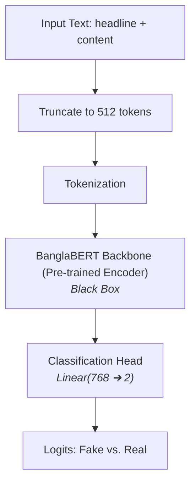
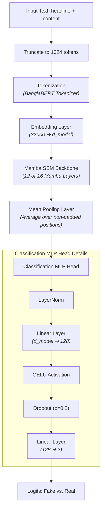
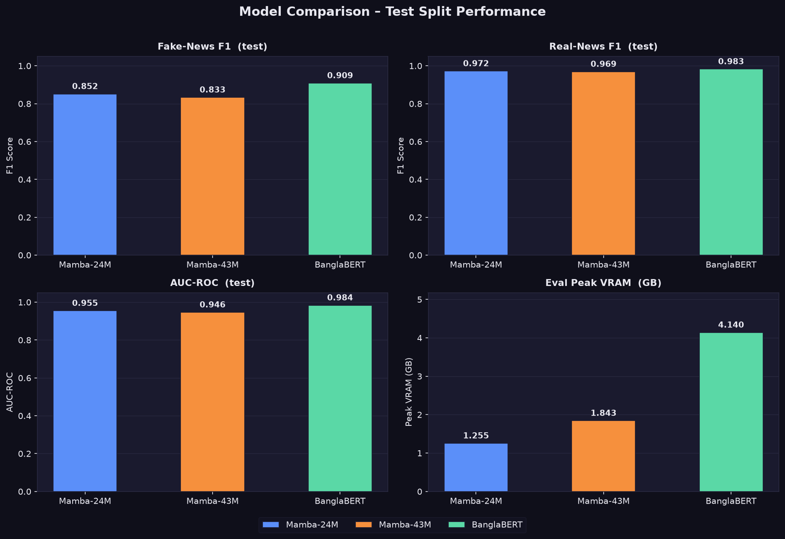
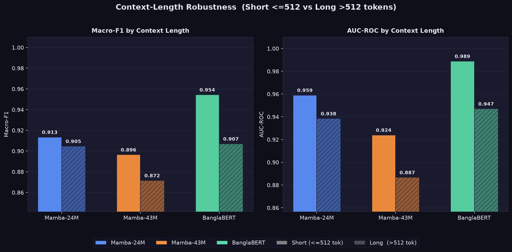

# Bangla Fake News Detection: Transformer (BanglaBERT) vs. State-Space Model (Bangla-Mamba)

An engineering-focused project comparing traditional **Transformers** against **State-Space Models (SSMs)** for binary fake news classification in the Bengali language.

---

## 📋 Table of Contents

- [Overview](#overview)
- [Research Questions](#research-questions)
- [Dataset](#dataset)
- [Models](#models)
- [Model Architecture](#model-architecture)
- [Project Structure](#project-structure)
- [Setup & Installation](#setup--installation)
- [Project Configuration](#project-configuration)
- [Pipeline Stages](#pipeline-stages)
- [Running the Pipeline](#running-the-pipeline)
- [Cloud Training (Modal)](#cloud-training-modal)
- [CPU Inference — Mamba Conversion](#cpu-inference--mamba-conversion)
- [Streamlit App](#streamlit-app)
- [Experiment Tracking (MLflow + DagsHub)](#experiment-tracking-mlflow--dagshub)
- [Results](#results)
- [Known Issues & Notes](#known-issues--notes)

---

## Overview

This project operates in the domain of **low-resource Bangla NLP**, targeting the automated detection of misinformation in online Bangla news articles. Bangla is the seventh most spoken language in the world (~230 million native speakers), yet it remains underserved in modern NLP application pipelines.

Existing Bangla fake news classifiers rely primarily on transformer-based models such as BanglaBERT, which inherit a fundamental architectural constraint: a fixed attention window of **512 tokens**. In practice, this forces models to silently truncate any article longer than roughly 350 words — discarding up to half the content before classification even begins.

Truncation is especially harmful for fake news detection, where inconsistencies, contradictory claims, or fabricated sources often appear in the **middle or toward the end** of an article. Furthermore, Transformer self-attention scales quadratically with sequence length ($O(N^2)$), making it computationally expensive to increase the context window.

This project implements and trains **State-Space Models (SSMs)** using the **Mamba** architecture to address both limitations:

| Advantage | Description |
|---|---|
| **1024-Token Context** | Processes up to 1024 tokens — double BanglaBERT's 512-token limit |
| **Linear Scaling** | Mamba scales $O(N)$ with sequence length, enabling efficient inference |
| **From-Scratch Training** | Evaluates Mamba's capability without massive pretraining corpora |

---

## Research Questions

This project answers two key engineering questions:

1. **Performance Parity** — Can a custom Bangla-Mamba model trained *completely from scratch* achieve comparable performance to a fully pre-trained, much larger BanglaBERT model?
2. **Context Window Advantage** — Does Mamba's longer context window (1024 tokens vs. 512) capture crucial signals in longer news articles that BanglaBERT must truncate?

### Evaluation Methodology

To isolate the context-length effect, the test set is split into two subsets:

- **Short Articles** (≤ 512 tokens): Both models receive the complete text — a pure capability baseline.
- **Long Articles** (> 512 tokens): BanglaBERT truncates at 512 tokens; Mamba reads the full 1024 tokens — the key experiment.

### Expected Outcomes

1. Demonstrate that a lightweight Bangla-Mamba model (24M–43M parameters) trained from scratch can match classification performance of a fine-tuned, 110M-parameter BanglaBERT baseline.
2. Measure a quantitative performance boost for Mamba on longer articles due to 1024-token context access.
3. Benchmark peak VRAM, training speeds, and parameter efficiency between the two architectures.

---

## Dataset

**BanFakeNews-2.0** — available on [HuggingFace](https://huggingface.co/datasets/hrshihab/BanFakeNews-2.0)

| Split | Proportion |
|---|---|
| Train | ~80% |
| Validation | ~10% |
| Test | ~10% |

**Label distribution (after cleaning):**
- Real (1): ~83.5% of articles *(majority class)*
- Fake (0): ~16.5% of articles *(minority class)*

Class imbalance is addressed via **weighted cross-entropy loss** with computed class weights: `Fake = 3.0295`, `Real = 0.5988`.

**Preprocessing steps:**
1. Merge headline and content as: `headline [SEP] content`
2. Strip HTML tags and URLs
3. NFC Unicode normalization (fixes overlapping Bangla characters)
4. Collapse whitespace; preserve punctuation (`!`, `?`, `...` are fake-news signals)
5. Filter: minimum 20 words, maximum 2000 words
6. Remove empty strings and duplicates

---

## Models

### BanglaBERT (Baseline)

| Property | Value |
|---|---|
| Base model | `csebuetnlp/banglabert` |
| Architecture | Transformer encoder (BERT-style) |
| Max context | 512 tokens |
| Input format | `headline [SEP] content` |
| Task | Binary classification (Fake = 0, Real = 1) |
| Training | Full fine-tuning |
| Precision | BF16 (A100) |
| Epochs | 5 |
| Optimizer | AdamW + OneCycleLR |
| Effective batch | 64 (32 × 2 grad accum) |

---

### Bangla-Mamba (Proposed)

Two Mamba configurations are trained from scratch:

| Property | BanglaMamba-Small (24M) | BanglaMamba-Large (43M) |
|---|---|---|
| Architecture | Mamba SSM backbone + 2-layer MLP head | Mamba SSM backbone + 2-layer MLP head |
| Parameters | ~24M | ~43.7M |
| Max context | **1024 tokens** | **1024 tokens** |
| Hidden dim (`d_model`) | 384 | 512 |
| Mamba blocks (`n_layer`) | 12 | 16 |
| Vocab | 32,000 (BanglaBERT tokenizer) | 32,000 (BanglaBERT tokenizer) |
| Pooling | Mean over non-pad positions | Mean over non-pad positions |
| Training | From scratch | From scratch |
| Precision | BF16 (A100) | BF16 (A100) |
| Learning rate | 1e-3 | 1e-3 |

The Mamba backbone uses `mamba-ssm`'s `MambaLMHeadModel` with the LM head discarded, keeping only the encoder backbone. The classification head follows the structure: `LayerNorm → Linear(d_model → 128) → GELU → Dropout(0.2) → Linear(128 → 2)`.

---

## Model Architecture

### 1. BanglaBERT Pipeline (Baseline)

BanglaBERT is used as a pre-trained "black box" encoder. The only modified components are the input sequence preparation (truncating to 512 tokens) and the classification head appended to the `[CLS]` token representation.



### 2. Bangla-Mamba Architecture (Proposed)

Bangla-Mamba models are trained from scratch with a custom multi-layer classification head. Unlike transformers, Mamba processes the sequence sequentially without self-attention, scaling linearly up to 1024 tokens. Mean pooling averages the hidden state vectors across all non-pad token indices to produce a stable sequence representation.



---

## Project Structure

```
Bangla-Fake-News-Detection/
│
├── app/
│   └── app.py                  # Streamlit web app (demo UI)
│
├── config/
│   ├── config.py               # Pydantic settings — file paths & MLflow URIs
│   └── params.py               # Pydantic settings — training hyperparameters
│
├── modal_utils/
│   ├── convert_mamba_to_hf.py  # Converts mamba-ssm weights → HuggingFace format (GPU/Modal)
│   ├── upload_folder.py        # Upload artifacts to Modal volume
│   ├── download_folder.py      # Download artifacts from Modal volume
│   ├── upload_file.py          # Upload single file to Modal volume
│   ├── delete_file.py          # Delete file from Modal volume
│   └── delete_folder.py        # Delete folder from Modal volume
│
├── notebooks/
│   └── EDA.ipynb               # Exploratory Data Analysis
│
├── src/
│   ├── data_ingestion.py       # Download, merge, clean, save dataset
│   ├── offline_tokenize.py     # Tokenize & cache dataset to disk (HuggingFace datasets)
│   ├── finetune_bert.py        # BanglaBERT fine-tuning pipeline
│   ├── evaluate_bert.py        # BanglaBERT evaluation (overall test set + long/short subsets)
│   ├── ssm_model.py            # Bangla-Mamba model architecture
│   ├── ssm_train.py            # Bangla-Mamba training pipeline
│   ├── evaluate_ssm.py         # Bangla-Mamba evaluation (overall test set + long/short subsets)
│   ├── predict.py              # Inference — BertPredictor / MambaPredictor
│   └── utils/
│       ├── common.py           # Shared utilities (create_directory, save_json, section)
│       ├── exception.py        # Custom exception with file/line info
│       └── logger.py           # Centralized logging setup
│
├── Artifacts/                  # Auto-generated — model weights, caches, logs
├── logs/                       # Pipeline run logs
│
├── main.py                     # Pipeline entry point (uncomment stages to run)
├── modal_run.py                # Modal cloud runner (GPU training)
├── Dockerfile                  # Docker image for Streamlit app
├── requirements.txt            # Python dependencies
└── .env                        # (not committed) MLflow credentials
```

---

## Setup & Installation

### Prerequisites

- Python 3.11
- GPU with CUDA 12.4+ *(required for training; CPU is sufficient for inference)*
- [Modal](https://modal.com/) account *(optional — for cloud GPU training)*

### 1. Clone & Create Virtual Environment

```bash
git clone https://github.com/Khalidi-Siam/Bangla-Fake-News-Detection.git
cd Bangla-Fake-News-Detection

python -m venv env
.\env\Scripts\activate   # Windows
# source env/bin/activate  # Linux/macOS
```

### 2. Install Dependencies

```bash
pip install -r requirements.txt
```

> ⚠️ **PyTorch version note:**
> - **Windows (native):** `torch==2.4.0` has known issues. Use `torch==2.12.1` instead.
> - **Docker / Linux (GPU):** `torch==2.4.0` works correctly for both CPU and GPU builds.

```bash
# CPU-only (default in requirements.txt)
pip install torch==2.4.0 --index-url https://download.pytorch.org/whl/cpu

# GPU (CUDA 12.4) — replace the line in requirements.txt
pip install torch==2.4.0+cu124 --index-url https://download.pytorch.org/whl/cu124
```

### 3. Install GPU-Only Mamba Dependencies

`causal-conv1d` and `mamba-ssm` **require CUDA** and cannot be installed on CPU-only machines. They are commented out in `requirements.txt` by default.

```bash
# Only install if you have a CUDA-capable GPU
pip install causal-conv1d==1.4.0 --no-build-isolation
pip install mamba-ssm==2.2.2 --no-build-isolation
```

> If you do not have a GPU, see [CPU Inference — Mamba Conversion](#cpu-inference--mamba-conversion) to run the pre-converted HuggingFace format instead.

### 4. Configure Environment Variables

Create a `.env` file in the project root for MLflow / DagsHub credentials:

```env
MLFLOW_TRACKING_USERNAME=your_dagshub_username
MLFLOW_TRACKING_PASSWORD=your_dagshub_token
```

> If running on Modal, set these as Modal secrets instead of using `.env`.

---

## Project Configuration

All configuration lives in the [`config/`](file:///d:/Bangla-Fake-News-Detection/config) directory:

| File | Purpose |
|---|---|
| [config.py](file:///d:/Bangla-Fake-News-Detection/config/config.py) | System-level settings: dataset names, directory paths, tokenization cache dirs, checkpoint folders, evaluation settings, and MLflow/DagsHub URIs |
| [params.py](file:///d:/Bangla-Fake-News-Detection/config/params.py) | Model & training hyperparameters: learning rates, batch sizes, epochs, sequence lengths, model dimensions, class weights, and DataLoader workers |

**To change any path, directory, model setting, or hyperparameter, edit these two files only.**

### Key Hyperparameter Breakdown

Below are the most critical training and model hyperparameters configured in `params.py`, explaining what they do and why their settings differ between BanglaBERT and Bangla-Mamba:

#### 1. Learning Rate (`learning_rate`)
*   **What it is:** The step size at which the optimizer updates model weights during gradient descent.
*   **Why it differs:**
    *   **BanglaBERT (`2e-5`):** Uses a small learning rate. Because the model is already pre-trained on a massive Bangla corpus, we only perform fine-tuning. A high learning rate would destroy ("catastrophic forgetting") the pre-learned language representations.
    *   **Bangla-Mamba (`1e-3`):** Uses a significantly higher learning rate. Since we train Mamba from scratch (random initialization), the model needs larger updates to learn general syntax, token relationships, and classification signals from scratch.

#### 2. Context Length (`max_length`)
*   **What it is:** The maximum number of tokens processed per input sequence before truncation.
*   **Why it differs:**
    *   **BanglaBERT (`512`):** This is a hard structural limit for BERT-style transformer architectures. Since self-attention scales quadratically ($O(N^2)$), processing longer sequences incurs severe memory and computational costs.
    *   **Bangla-Mamba (`1024` or `768`):** Mamba scales linearly ($O(N)$), allowing us to double the sequence length to 1024. This captures crucial information near the middle or end of long news articles that BanglaBERT is forced to truncate.

#### 3. Effective Batch Size (`batch_size` & `grad_accum`)
*   **What it is:** The number of samples processed before updating model parameters. The effective batch size is calculated as: `effective_batch_size = batch_size * grad_accum`.
*   **Why it matters:** 
    *   Larger effective batches stabilize gradient calculations and accelerate training. 
    *   By using gradient accumulation (`grad_accum = 2`), we run smaller physical batches (`batch_size = 32`) to fit inside VRAM while enjoying the optimization stability of a larger batch size (`64`).

#### 4. Loss Class Weights (`class_weights`)
*   **What it is:** A weighting factor applied to the cross-entropy loss function (`[Fake=3.0295, Real=0.5988]`).
*   **Why it matters:** The BanFakeNews-2.0 dataset is highly imbalanced (~83.5% Real, ~16.5% Fake). Without weighting, a classifier could achieve high accuracy by simply predicting "Real" for every news article. Applying inverse frequency weights penalizes errors on the minority ("Fake") class 5× harder, forcing the model to learn features of misinformation.

#### 5. Learning Rate Warmup (`warmup_pct`)
*   **What it is:** The fraction of total training steps during which the learning rate gradually climbs from 0 to its maximum value (e.g., first 10% of training steps).
*   **Why it matters:** Prevents early training instability. When training starts, gradients can be large and noisy. Gradually scaling the learning rate up prevents weight distortion or numerical overflow in early updates, followed by a smooth cosine decay schedule.

#### 6. Mamba Capacity (`d_model` & `n_layer`)
*   **What it is:** `d_model` determines the width (hidden state dimension) and `n_layer` controls the depth (number of stacked Mamba blocks).
*   **Why it matters:** These hyperparameters define model capacity and parameter counts (24M for small, 43M for large). When training from scratch on relatively small datasets, selecting these values is a trade-off: too large a model causes rapid overfitting, while too small a model fails to capture complex linguistic patterns.

---

## Pipeline Stages

The pipeline is orchestrated through [`main.py`](file:///d:/Bangla-Fake-News-Detection/main.py). Each stage is independent and runs in order by uncommenting the relevant block.

```
Stage 1: Data Ingestion         → Artifacts/data.csv
Stage 2: Offline Tokenization   → Artifacts/tokenized_cache_bert/  (or mamba/)
Stage 3: BanglaBERT Fine-Tuning → Artifacts/best_model/banglabert/ (auto-triggers evaluation)
Stage 4: BanglaBERT Evaluation  → Artifacts/logs/banglabert_results.json
Stage 5: Bangla-Mamba Training  → Artifacts/best_model/mamba_1024/ (auto-triggers evaluation)
Stage 6: Bangla-Mamba Evaluation → Artifacts/logs/mamba_1024_results.json
```

> **Tokenization note:** At `max_length=512`, the same tokenized cache can be shared between BanglaBERT and Mamba. For Mamba at `max_length=1024`, a separate cache must be generated. Set `max_length` in [`config/config.py`](file:///d:/Bangla-Fake-News-Detection/config/config.py) before running Stage 2.

---

## Running the Pipeline

Edit [`main.py`](file:///d:/Bangla-Fake-News-Detection/main.py) and uncomment the stage(s) you want to run, then execute:

```bash
python main.py
```

### Stage-by-Stage Reference

**Stage 1 — Data Ingestion**
```python
stage = "Data Ingestion"
data_ingestion = DataIngestion()
data_ingestion.initialize_data_ingestion()
```

**Stage 2 — Offline Tokenization** *(set `max_length` in config first)*
```python
stage = "Offline Tokenization"
offline_tokenizer = OfflineTokenize()
offline_tokenizer.initialize_tokenization()
```

**Stage 3 — BanglaBERT Fine-Tuning** *(requires GPU; auto-triggers evaluation)*
```python
stage = "BanglaBERT Fine-Tuning"
bert_finetuner = BertFineTune()
bert_finetuner.initialize_bert_finetuning()
```

**Stage 4 — Bangla-Mamba Training** *(requires GPU with `mamba-ssm` installed; auto-triggers evaluation)*
```python
stage = "Bangla-Mamba Training"
mamba_trainer = MambaTrainer()
mamba_trainer.initialize_mamba_training()
```

---

## Cloud Training (Modal)

Training is designed to run on [Modal](https://modal.com/) using an **NVIDIA A100-40GB** GPU. The [`modal_run.py`](file:///d:/Bangla-Fake-News-Detection/modal_run.py) script provisions a CUDA 12.4 Docker image, installs all dependencies (including `mamba-ssm`), and runs `main.py` remotely.

```bash
# 1. Install Modal client
pip install modal

# 2. Authenticate
modal setup

# 3. Run training on Modal cloud (A100-40GB)
modal run modal_run.py
```

The Modal runner uses a persistent volume (`datasets-volume`) to store artifacts between runs. Utility scripts in [`modal_utils/`](file:///d:/Bangla-Fake-News-Detection/modal_utils) allow you to upload/download files from the volume.

---

## CPU Inference — Mamba Conversion

`causal-conv1d` and `mamba-ssm` require CUDA kernel compilation and **cannot run on CPU**. To use a trained Mamba model locally without a GPU, convert it to the HuggingFace `MambaModel` format.

### Step 1: Convert on Modal (GPU required)

```bash
modal run modal_utils/convert_mamba_to_hf.py
```

This script:
1. Loads trained weights from `Artifacts/best_model/mamba_1024/`
2. Remaps state dict keys (`backbone.embedding.*` → `backbone.embeddings.*`)
3. Saves a HuggingFace-compatible model to `Artifacts/best_model/mamba_1024_hf/`
4. Commits the result to the Modal volume

### Step 2: Download to Local Machine

```bash
python modal_utils/download_folder.py
```

> Set `TARGET_FOLDER = "mamba_1024_hf"` in [`modal_utils/download_folder.py`](file:///d:/Bangla-Fake-News-Detection/modal_utils/download_folder.py) before running.
>
> After downloading, unzip and place the folder at: `Artifacts/best_model/mamba_1024_hf/`

### Step 3: Run CPU Inference

The model loads from `mamba_1024_hf/` using HuggingFace `MambaModel` (pure PyTorch — no CUDA extensions required).

> To run inference on a GPU instead, update [`src/predict.py`](file:///d:/Bangla-Fake-News-Detection/src/predict.py) to load the model using `mamba-ssm`.

---

## Streamlit App

An interactive web demo is included at [`app/app.py`](file:///d:/Bangla-Fake-News-Detection/app/app.py). It supports both BanglaBERT and Bangla-Mamba inference with a bilingual (Bengali + English) UI.

### Run Locally

```bash
streamlit run app/app.py
```

### Run with Docker

```bash
docker build -t bangla-fake-news .
docker run -p 8501:8501 bangla-fake-news
```

**App features:**
- Model selector: BanglaBERT or Bangla-Mamba
- Bilingual UI (Bengali input fields + English labels)
- Quick-load example articles (2 real, 2 fake)
- Probability breakdown meter (Fake / Real confidence)
- Inference latency and token count display
- Preprocessing inspector (shows cleaned input text)

> ⚠️ The app requires pre-trained model weights in `Artifacts/best_model/`. Both models run on **CPU** in the app.

---

## Experiment Tracking (MLflow + DagsHub)

All training runs are tracked via MLflow on DagsHub.

**Tracking URI:** https://dagshub.com/Khalidi-Siam/Bangla-Fake-News-Detection.mlflow

> All experiment runs, metrics, parameters, and artifacts are publicly visible. Anyone can visit the link above to inspect and compare logged experiments.

**Logged per run:**
- All hyperparameters (model name, batch size, LR, `max_length`, etc.)
- Final test metrics: Macro-F1, AUC-ROC, per-class Precision / Recall / F1
- Model artifacts *(optional — set `log_model: False` in config to skip large uploads)*
- Traning summary and log file

Configure credentials via `.env` (see [Setup & Installation](#setup--installation)).

---

## Results

### Test-Split Performance

The figure below compares all three models on the test set across four dimensions: **Fake-News F1**, **Real-News F1**, **AUC-ROC**, and **peak evaluation VRAM** (converted from MB → GB).



> **Key takeaways:**
> - BanglaBERT leads on classification metrics thanks to large-scale Bangla pretraining.
> - BanglaMamba-Small (24M) matches BanglaBERT closely on Fake-F1 and AUC-ROC while using **3–4× less VRAM** and **80% less parameter**.
> - BanglaMamba-Large (43M) gives similar results to BanglaMamba-Small. Though the model is larger, it provides no extra improvement since the dataset was insufficient for the larger model to benefit from its increased capacity. After about two epochs, both models began to overfit, indicating that the dataset size limited further improvements through longer training.

---

### Context-Length Robustness

The figure below shows **Macro-F1** and **AUC-ROC** broken down by article length — short articles (≤ 512 tokens, solid bars) vs. long articles (> 512 tokens, hatched bars).  
BanglaBERT must truncate long articles; Mamba models read them in full.



> **Key takeaways:**
> - BanglaBERT's Macro-F1 drops **~4.7 percentage points** on long articles due to truncation.
> - BanglaMamba-Small degrades by only **~0.9 percentage points**, demonstrating strong long-context robustness.
> - Mamba's linear-complexity SSM is a natural fit for longer Bangla news articles.

The evaluation covers:
- **Overall test set** — Macro-F1, AUC-ROC, per-class Precision / Recall / F1
- **Short subset** (≤ 512 tokens) — all models see the full text; serves as the baseline comparison
- **Long subset** (> 512 tokens) — BanglaBERT truncates; Mamba models process the complete article — the key context-length experiment

---

## Limitations

- **Mamba trained from scratch** — Unlike BanglaBERT, Bangla-Mamba has no pretrained language understanding. This places it at a significant disadvantage on small datasets where pretraining corpora would otherwise provide rich priors.
- **Insufficient data for from-scratch training** — Because no pretrained Bangla-Mamba checkpoint exists, the model must learn language representations entirely from the BanFakeNews-2.0 dataset. This dataset, while adequate for fine-tuning a pretrained model, is too small to support robust generalization when training from scratch. Consequently, the model overfits rapidly — performance degrades beyond the first epoch — limiting practical training to a single epoch and leaving significant headroom unexplored.
- **Dataset imbalance** — The dataset is heavily skewed (~83.5% real), which limits model sensitivity to fake articles even with weighted loss.
- **Single dataset** — All experiments are conducted on BanFakeNews-2.0 only; generalization to other Bangla news sources or domains is untested.
- **No multimodal signals** — The pipeline uses text only. Images, metadata, author information, and publication source — all strong fake-news indicators — are not used.
- **Mamba-SSM CUDA dependency** — The `mamba-ssm` library requires CUDA kernel compilation, making local CPU-only training and inference unavailable without a conversion step.

---

## Future Improvements


- **Extend context further** — Test Mamba at 2048+ tokens, which is infeasible for standard Transformers but natural for SSMs.
- **Cross-domain evaluation** — Benchmark on additional Bangla fake-news datasets to measure out-of-domain generalization.
- **Hyperparameter search** — Apply systematic tuning (e.g., Optuna) to Mamba's `d_model`, `n_layer`, and learning rate schedule.
- **Pretrain Bangla-Mamba** on a large Bangla text corpus before fine-tuning to close the performance gap with BanglaBERT.
- **Hybrid architectures** — Explore Transformer + Mamba hybrid models (e.g., attention for local context, SSM for long-range dependencies).

---
## Known Issues & Notes

- **PyTorch on Windows** — `torch==2.4.0` causes errors on Windows. Use `torch==2.12.1` if running natively on Windows. The Docker image (Linux) works fine with `2.4.0`.

- **Mamba Requires GPU to Train** — `causal-conv1d` and `mamba-ssm` are CUDA extensions that require a GPU to install and run. There is no CPU fallback for training. Use Modal for cloud GPU access, then convert the trained weights to HuggingFace format for local CPU inference (see [CPU Inference](#cpu-inference--mamba-conversion)).

- **Class Imbalance** — The dataset is heavily imbalanced (~83.5% Real, ~16.5% Fake). Weighted cross-entropy loss is applied with pre-computed class weights (`Fake=3.03, Real=0.60`). The Macro-F1 score (not accuracy) is used as the primary evaluation metric to account for this imbalance.
